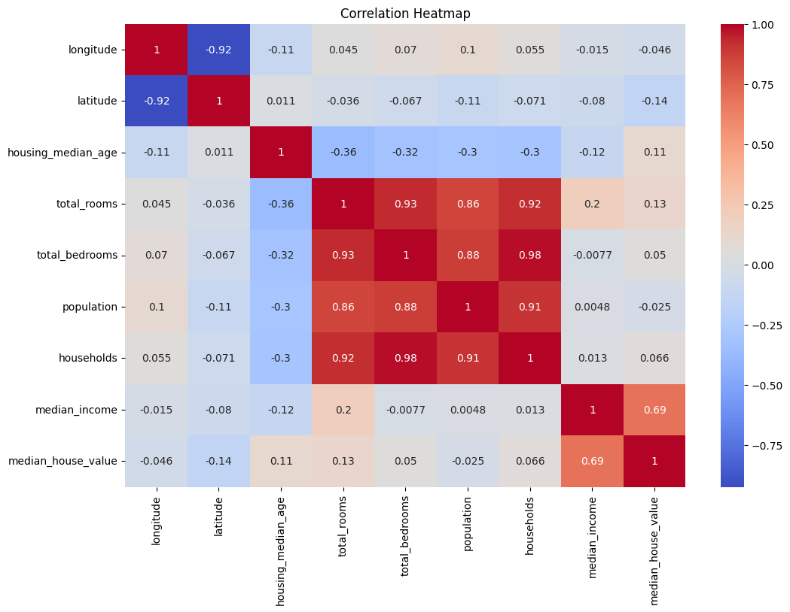

# California House Price Prediction 🏠
This project aims to predict median house prices in California using Machine Learning. It covers the full pipeline from data cleaning and exploration to model deployment.

- [Dataset](#dataset)
- [Preprocessing & EDA](#preprocessing--eda)
- [Model & Evaluation](#model--evaluation)
- [Technologies Used](#technologies-used)
- [How to Run](#how-to-run)

- ## Data Visualization
During the Exploratory Data Analysis (EDA), I analyzed feature correlations and geographical distributions.

*Figure 1: Heatmap showing the correlation between different features and the target price.*

## 🌐 Interactive User Interface (Deployment)

To make the model accessible, I developed a web interface using **Gradio**. This allows users to input housing features and receive instant price predictions based on the trained Random Forest model.

  
   
  <em>Figure 2: Real-time prediction interface powered by Gradio.</em>

### Key Interface Features:
- **Real-time Prediction:** Uses the pre-trained `.pkl` model to provide fast results.
- **User-Friendly Inputs:** Includes sliders and dropdowns for easy data entry (e.g., Median Income, Ocean Proximity).
- **Seamless Integration:** Runs directly from the Google Colab environment.

- ## 🧠 Technical Insights

### Model Selection
We chose the **Random Forest Regressor** for this project because it effectively handles the non-linear relationships within the California housing dataset and provides better generalization compared to simpler models.

### Key Technical Achievements:
- **Data Preprocessing:** Successfully handled missing values and performed feature scaling.
- **Categorical Encoding:** Integrated `Ocean Proximity` using One-Hot Encoding for better model interpretation.
- **Deployment:** Integrated a Machine Learning backend with a Gradio frontend for a complete user experience.

## 👥 Contributors
Ahmed abdelgwad zalta
Esraa Hussein Abdelrazek
Habiba Hossam Elgendy
Alaa Samy Mahmoud
Basmala fathy zakaria
This project was a collaborative effort by our team at **MTI University** as part of the **IEEE Student Branch** graduation requirements.
- **Ahmed Zalta** - Lead ML Developer.
- [ibutor.
-

